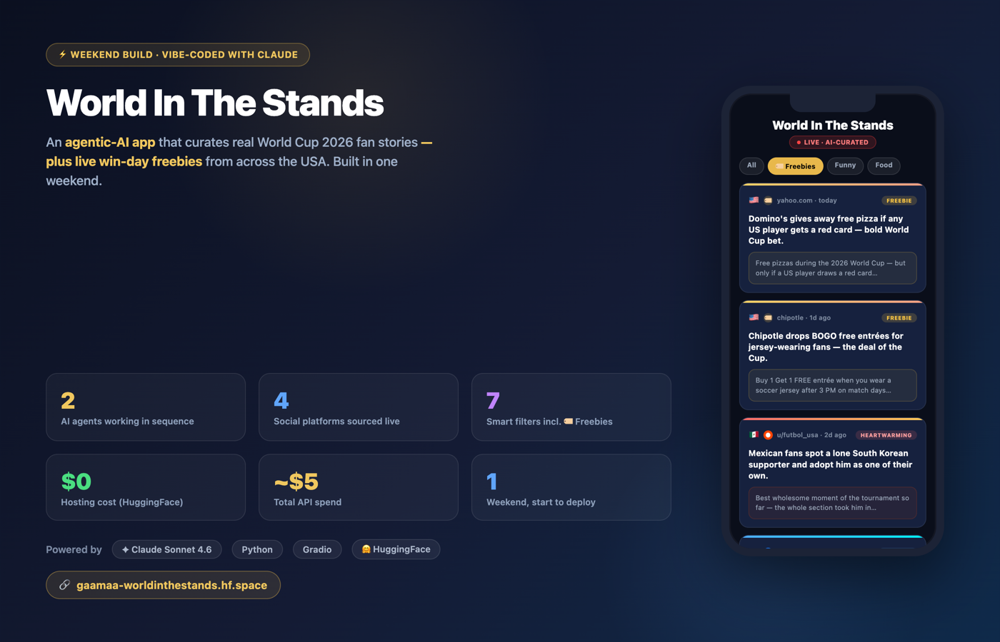
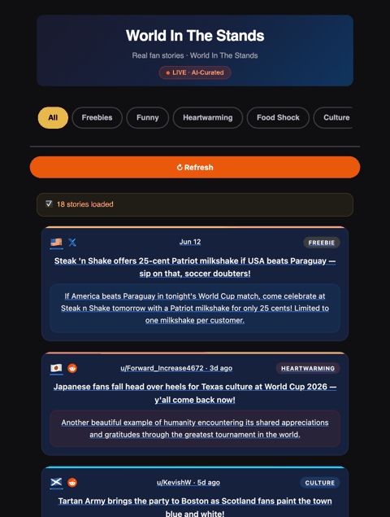
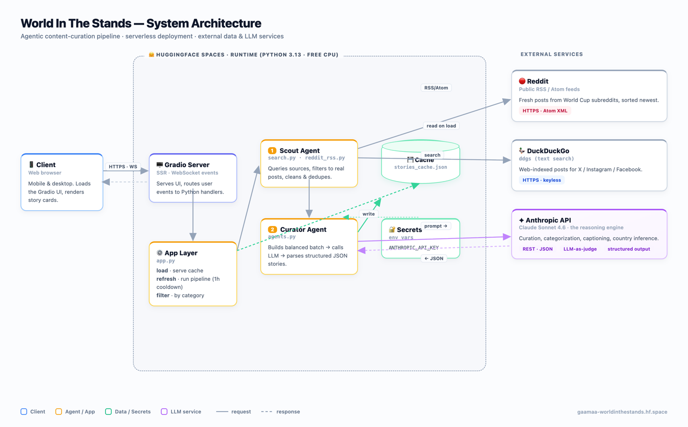

# 🌎 World In The Stands ⚽

An **agentic-AI app** that finds and curates the funniest, most heart-warming fan
moments from **World Cup 2026** across the USA — plus a live **🏷️ Freebies** feed
of every "free food if the USA wins" deal, with the expired ones filtered out.

🔗 **Live demo:** https://gaamaa-worldinthestands.hf.space



---

## What it does

- Pulls real fan posts in real time from **Reddit, X, Instagram & Facebook**
- Uses **Claude** to decide what's actually worth showing, tag it by theme, and write a punchy caption
- Surfaces **win-day freebies** from brands (Steak 'n Shake, McDonald's, Chipotle, Jeep…) and only shows deals that are still claimable today
- Serves it all as a clean, mobile-first card feed with category filters



## How it works

Two agents work in sequence:

| Agent | Job |
|-------|-----|
| 🔍 **Scout** (`search.py`, `reddit_rss.py`) | Runs targeted queries across all four platforms, keeps only real posts, cleans & dedupes |
| 🧠 **Curator** (`agents.py`) | Sends a balanced batch to Claude, which judges relevance, categorizes, writes captions, infers country, and flags freebies |

Results are cached (`stories_cache.json`) so the page loads instantly, with a
1-hour refresh cooldown to keep API costs low.



## Tech stack

- **AI:** Claude Sonnet 4.6 (Anthropic API) · multi-agent design · LLM-as-judge
- **Data:** Reddit RSS · DuckDuckGo (`ddgs`)
- **App:** Python 3.13 · Gradio 6 · custom HTML/CSS cards
- **Infra:** HuggingFace Spaces (free CPU) · git-push deploy

## Run it locally

```bash
pip install -r requirements.txt
export ANTHROPIC_API_KEY="sk-ant-..."   # your Anthropic API key
python app.py
```

Then open http://localhost:7860.

> Curation requires an `ANTHROPIC_API_KEY`. On HuggingFace, set it as a Space secret.

## Project layout

```
app.py          Gradio UI, caching, prewarm, filter wiring
agents.py       Curator agent — Claude prompt, balancing, JSON parsing
search.py       Scout agent — DuckDuckGo queries, filtering, cleaning
reddit_rss.py   Fresh Reddit posts via RSS feeds
ui.py           Card renderer + styles
```

---

Built with [Claude](https://claude.com/claude-code) over a weekend. ⚽
